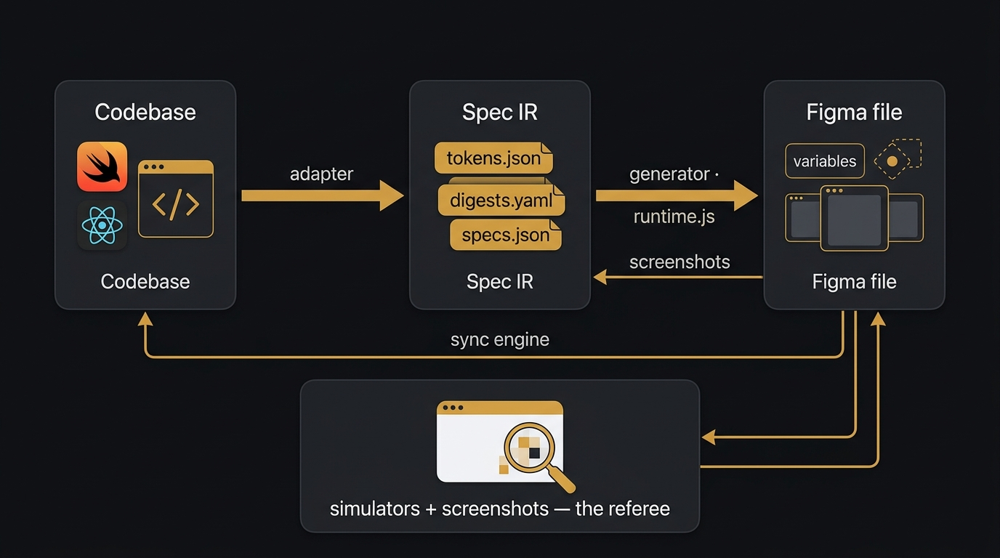

# Vibe2Fig

Reverse-engineer a **SwiftUI or React** codebase into an **editable,
componentized, render-verified Figma file** — tokens, component sets,
per-screen frames, and documentation pages — with the code as the only source
of truth (no screenshot tracing). Works with any SwiftUI or React program.



**The method in one sentence:** code supplies the numbers, a seeded running
app (simulator for SwiftUI, browser for React) supplies the rendered truth,
the `state.json` ledger supplies the memory, component sets supply the
consistency, and a screenshot-verify loop closes every write. Full rationale:
[docs/SKILL_ANALYSIS.md](docs/SKILL_ANALYSIS.md).

## Install

One command — clones (or updates) the repo, installs dependencies, registers
the Figma MCP server, and installs the agent skill:

```bash
curl -fsSL https://raw.githubusercontent.com/CodyChuGit/Vibe2Fig/main/install.sh | bash
```

Already cloned? Just run `./install.sh` — it's idempotent.

### Dependencies

Installed or checked by `install.sh`:

| Dependency | Used for | Auto-installed? |
|---|---|---|
| Python 3 + [Pillow](https://pypi.org/project/pillow/) | capture, pixel measurement, asset prep | yes (`pip`) |
| A skills-capable coding agent | runs the workflow — any agent/model that loads `SKILL.md` files and speaks MCP | no — bring your own |
| Figma MCP server (`https://mcp.figma.com/mcp`) | all Figma reads/writes | yes, when an agent CLI is detected |
| Xcode + simulators | SwiftUI verification loop | no — macOS/App Store |
| A browser / dev server | React verification loop | no |
| UI/UX Pro Max skill | layout quality (recommended) | no — optional |

### Agentic install

Or let your agent do it — paste this into any coding agent:

```text
Install Vibe2Fig: run
`curl -fsSL https://raw.githubusercontent.com/CodyChuGit/Vibe2Fig/main/install.sh | bash`,
then verify the `vibe2fig` skill is loaded (SKILL.md in your skills
directory) and the Figma MCP server (https://mcp.figma.com/mcp) is
connected — register it in your MCP config if not. If Pillow is missing,
`pip install pillow`. Finish by telling me the repo path and confirming the
skill triggers on "turn this app into a Figma file".
```

### Manual install

```bash
git clone https://github.com/CodyChuGit/Vibe2Fig.git && cd Vibe2Fig
pip install pillow
# register the Figma MCP server (https://mcp.figma.com/mcp) with your agent,
# then link the skill into your agent's skills directory, e.g.:
ln -s "$(pwd)/vibe2fig_skill" <your-skills-dir>/vibe2fig
```

## Agentic usage (the skill)

[`vibe2fig_skill/SKILL.md`](vibe2fig_skill/SKILL.md) turns the workflow into
an invocable agent skill with **phase gates**: Register → Ground truth →
Foundations → Pages → Verify → Ledger/Update. Once installed, prompts like

- *"turn this app into a Figma file"* (first build, phases 0–5)
- *"add the new screens to the Figma"* / *"update the assets"* (update mode —
  diffs code against the ledger, builds only the delta)
- *"show the app at all device sizes in Figma"*

trigger it. The skill enforces the five hard rules (derive from code / place
from pixels; nothing raw on an exhibit; screenshot every write batch; ledger
everything; never touch a live save) and points the agent at
[docs/GOTCHAS.md](docs/GOTCHAS.md) — the session-tested trap list for the
Figma Plugin API, simulators, and pixel measurement.

**Recommended companion:** install the **UI/UX Pro Max** skill alongside —
Vibe2Fig supplies correctness (measured geometry, componentization, code
truth); UI/UX Pro Max supplies the layout craft (page composition, type,
color systems). The Vibe2Fig skill invokes it automatically for page-design
decisions when present, and falls back to its built-in page grammar when not.

## Quickstart (first build)

1. `cp projects/example/config.example.json projects/<app>/config.json` and
   fill it in (bundle id, **save path read from the persistence code**,
   device table).
2. Extract tokens — SwiftUI: `python3 adapters/swiftui/extract_tokens.py …`;
   React: tokens from Tailwind config / CSS variables (see
   `adapters/react/README.md`).
3. Write layout digests per [core/spec_schema.md](core/spec_schema.md)
   (LLM pass over source — reviewable, diffable YAML).
4. Ground truth: seed a deterministic app state, then capture it —
   SwiftUI: `python3 tools/capture.py --config projects/<app>/config.json --app <.app> --seed <save> --state home --out projects/<app>/captures/`;
   React: screenshot the seeded routes in a browser at the target viewports.
   Either way, finish with `python3 tools/measure.py projects/<app>/captures/*.png`.
5. Let the skill build foundations → pages, verifying each section against
   the captures, and persist everything to `projects/<app>/state.json`.

## Layout

```
vibe2fig_skill/  SKILL.md — the agentic workflow (link into your agent's skills dir)
core/            runtime.js (Plugin-API interpreter), spec_schema.md,
                 upload.py, render_html.py, build_chunk.py
adapters/        swiftui/ (extract_tokens.py, digest contract), react/ (plan)
sync/            v2 engine: figma_to_spec.js, extract_chunk.py, spec_diff.py
tools/           capture.py (seeded-sim harness), measure.py (px→pt)
docs/            SKILL_ANALYSIS.md (why this works), GOTCHAS.md (trap list)
projects/        your apps (git-ignored) — ledger, specs, captures. See
                 projects/README.md and projects/example/.
```

## v2 — Figma → code (implemented)

The **Production Screens** page is the sync surface: an editable section of
frames that round-trips. Edit a frame and `sync/` turns the delta into a
source-anchored change order; change the code and the same frames are rebuilt
to match. See [sync/README.md](sync/README.md).

```
extract (figma_to_spec.js) → diff vs canonical (spec_diff.py, ±0.5 pt)
  → change order with source anchors → agent patches the code
  → rebuild + seeded capture + measure → pixels confirm → re-snapshot
```

Proven on the SwiftUI pilot: a 4 pt HUD nudge in Figma became a one-line code
patch whose rebuilt render measured the shift at **exactly +4.0 pt**, then the
reverse pass restored the frame from code to a zero-op fixpoint.

## Roadmap

- **v1 (done)**: SwiftUI → Figma, render-verified, incremental updates via
  the ledger.
- **v2 (done)**: Figma → code via the Production Screens sync surface —
  extract → diff → source-anchored change order → verified patch.
- **v1.5 (next)**: React adapter to parity — tokens from Tailwind/CSS vars,
  digests from JSX, browser captures as ground truth; same spec IR, runtime,
  and sync engine.

## License

MIT — see [LICENSE](LICENSE).
